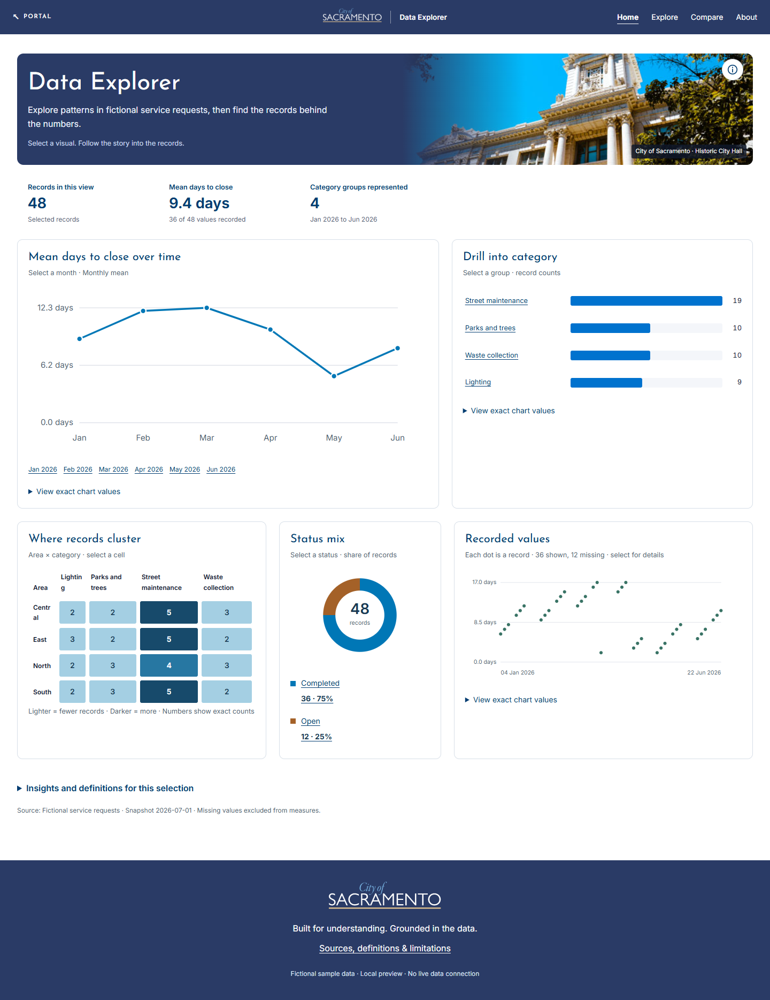
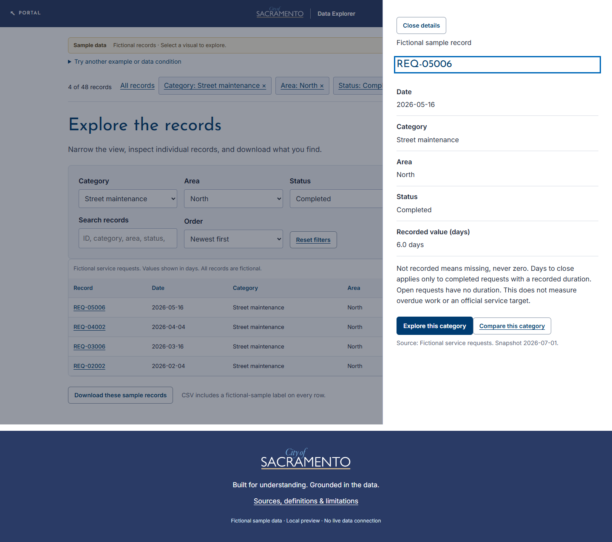

# City App Kit

**Turn a question about City work into a visual, local data app—with a short conversation in your coding assistant.**

City App Kit is a Python Shiny starter for City colleagues who want to build an explorable, visuals-first data app without beginning from a blank page. It includes a guided app-building skill, reusable City-styled components, and clearly labeled fictional examples to make the first version concrete.

**v0.5.2 · Python Shiny · fictional sample-data edition**



## Start here: preview the sample

You need **Windows and Python 3.12**. No manual package-install steps are needed.

1. Clone or download this kit into a normal development folder:

   ```powershell
   git clone https://github.com/socDocarol/city-app-kit.git
   cd city-app-kit
   ```

2. Open [Preview sample.cmd](Preview%20sample.cmd).
3. Keep its terminal window open while you explore. Press `Ctrl+C` there to stop the app.

The first launch creates a local virtual environment, installs the app runtime, and opens the app in your browser. Later launches reuse that setup. The sample runs locally at a loopback address.

Every included data record is fictional. The optional City Hall photograph supplies visual context, not source data. The preview does not connect to City systems, use credentials, or call an in-app AI service.

## What you can explore

The desktop-first Home view uses a wide canvas up to 1,920 pixels, with an optional image banner and a prominent trend. Ranked bars, status composition, a category-by-area heatmap, and selectable records share the space. Drill from a category, area, status, or month to the records behind it. Explore adds search, filters, record details, and a matching CSV download. Compare places two groups side by side and aligns their monthly patterns. About explains definitions and limits.

Selections stay with you as you move between views, refresh the page, or use browser Back and Forward. The preview also lets you switch between fictional service-request and spending examples, and show states such as missing, stale, empty, unavailable, and loading data.

Source notes and demo controls live behind the small **information icon** beside the introduction. Hover, focus, click, or tap it to reveal the details; open **Preview options** to switch examples. Escape or a click outside closes it. An amber icon flags data that needs attention.



## Build your own first version with an AI

Open this repository in a coding assistant that can read and edit files and run Python. Then paste this prompt:

> Read [skills/city-app-builder/SKILL.md](skills/city-app-builder/SKILL.md) and use its bundled starter to help me build a City data app. Keep the conversation short: ask only the questions needed for a useful first version, up to three by default. Start with fictional data and create my app in a new folder. I want to help **[audience]** understand **[main question]**.

For example, add: “Managers need to see which service-request types are increasing.” Your assistant should use answers you have already given, propose sensible defaults, and create a separate app. Real data can be planned later; this release does not ask for database credentials or inspect live sources.

The assistant asks once whether you want a banner: **use the example image**, **provide your own**, or **no banner**. That choice is part of the three-question budget. The demo shows the image option; new apps start without one unless you opt in. If your image is not ready, the assistant builds the preview and records it as pending.

If your coding assistant supports installed skills, install the complete [city-app-builder](skills/city-app-builder/) folder using that assistant’s normal skill-installation process. Keep its scripts, references, and assets together. The prompt above also works when the skill stays in this repository.

## Reusable pieces

| Included piece | What it gives you |
| --- | --- |
| [Guided app-building skill](skills/city-app-builder/SKILL.md) | A bounded discovery conversation, brief, build, and review workflow |
| [Working starter](skills/city-app-builder/assets/starter/) | Home, Explore, Compare, and About with linked visual drilldowns |
| [Component recipes](skills/city-app-builder/references/components.md) | Patterns for selections, details, comparisons, and visual compositions |
| [Data contract](skills/city-app-builder/references/data-contract.md) | The prepared record and metadata shape for a future source |
| [Visual standard](skills/city-app-builder/references/city-visual-standard.md) | The bundled City visual rules used by the starter |
| [Scaffold command](skills/city-app-builder/scripts/scaffold.py) | A safe copy of the starter into a new app folder |

The included services sample has 48 invented requests. The spending sample has 48 invented entries, including credits. Sample labels remain visible in the app and every exported CSV row.

## Optional: scaffold from the command line

If you maintain the kit or prefer a direct starting point, run this from the kit root:

```powershell
python skills/city-app-builder/scripts/scaffold.py "C:/Projects/my-city-app" --title "My Data Explorer" --sample services --future-source sql-server
```

This creates a standalone copy only in a new folder. `--future-source` records the intended source; it does not create a connection. Available choices are `unknown`, `file`, `sql-server`, `api`, and `sacramento-open-data`. Open the new folder and run `python start.py`.

Add `--banner` to include the bundled image after choosing it. To use your own image, copy it into the new app's `www/assets` and set its `banner` image path, alt text, and credit in `app_config.json`. Set `banner` to `null` for the layout without an image. See the [build reference](skills/city-app-builder/references/building.md) for the exact format.

## Current scope

| Working now | Deferred in this release |
| --- | --- |
| Local Python Shiny preview; fictional services and spending samples; visual drilldowns; search, filters, detail drawers, comparisons, CSV; shared selections and truthful sample/data states | Live connectors, credentials, real-source interpretation, deployment or hosting, an in-app AI/chat service, and independent model-performance claims |

The kit was tested on Windows with Python 3.12 and Microsoft Edge. Read the [verification record](docs/verification.md) for the checks performed and their limits. Read [maintenance instructions](docs/maintenance.md) to verify or package the kit.

## Assets and sharing

City branding and related assets are for internal use under the boundaries recorded in [ASSETS.md](skills/city-app-builder/assets/starter/ASSETS.md). This repository does not grant a public license for City identity artwork or imply one for City-specific code.
